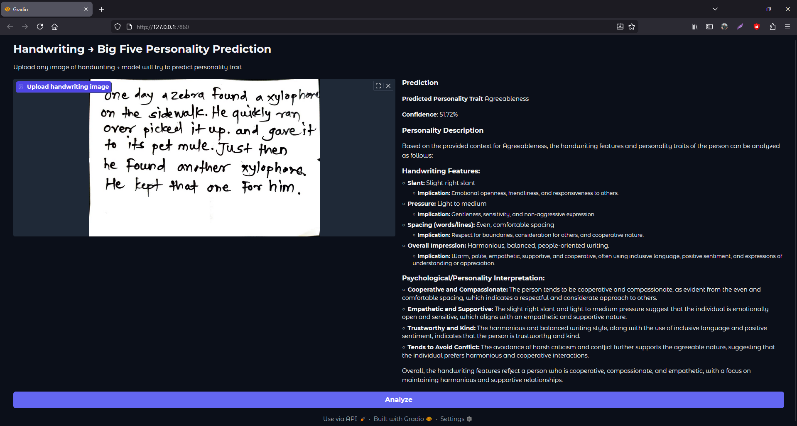

# Signature Analysis Personality Report

An end-to-end system that analyzes **handwritten signatures** using deep learning and generates detailed personality reports using **Retrieval-Augmented Generation (RAG)**.



The project combines:
- **Signature image classification** (deep learning model) to detect key handwriting features
- **RAG pipeline** that uses detected traits + knowledge base documents about personality traits to generate natural-language personality analysis reports

## ✨ Project Highlights

- CNN-based signature feature extraction / trait classification
- Modern **RAG** (Retrieval Augmented Generation) approach for explainable personality insights
- Clean Gradio web interface for uploading signature and getting instant report
- Modular structure with separated data prep, training, and inference code

## 📁 Project Structure

```
signature_analysis_personality_report/
├── common/                    # Shared utility modules & helper functions
│   └── (utils.py, config.py, rag_helper.py, etc.)
├── RAG_Documents/             # Knowledge base - Personality traits documentation
│   ├── Agreeableness - PDF Information
│   ├── Conscientiousness - PDF Information.pdf
│   ├── Extraversion - PDF Information.pdf
│   ├── Neuroticism - PDF Information.pdf
│   └── Openness - PDF Information.pdf
├── .gradio/                   # Gradio cache (auto-generated - gitignored)
├── data_preparation.ipynb     # Data cleaning, augmentation, preprocessing pipeline
├── model_training.ipynb       # Model architecture, training & evaluation
├── app.py                     # Main Gradio web application + RAG inference
├── RAG_Signature_Analysis.ipynb      # Original/Experimental RAG implementation
├── RAG_Signature_Analysis-Original.ipynb
├── requirements.txt           # All required python packages
├── signature_dataset.csv      # Metadata / labels (if used)
├── signature_model_tfdata.keras   # Trained model file (TensorFlow/Keras format)
├── .gitignore
├── CUDA Installation Steps.txt
└── RAG vs Agentic RAG.jpg     # Comparison diagram (useful for documentation)
```

## 🛠️ Tech Stack

- **Deep Learning**: TensorFlow / Keras
- **RAG Pipeline**: Likely LangChain / LlamaIndex + local or cloud LLM
- **Web Interface**: Gradio
- **Data Handling**: pandas, numpy, OpenCV / PIL
- **Others**: sentence-transformers / HuggingFace embeddings, FAISS/Chroma vector store

## 📁 Dataset Overview

This dataset provides handwriting samples categorized according to the **Big Five personality traits** (also known as the OCEAN model). It is designed for research and development in personality detection through handwriting analysis.

*   **Dataset Name**: Handwriting based personality detection
*   **Provider**: Vuppala Adithya Sairam
*   **Update Date**: Updated 2 years ago (from the source publication date of 2023-11-20)
*   **Size**: Approximately 1.37 GB
*   **Files**: 4,076 files in total
*   **Download Link**: [Handwriting based personality detection on Kaggle](https://www.kaggle.com/datasets/vuppalaadithyasairam/handwriting-based-personality-detection)

## 🚀 Quick Start

### 1. Clone the repository

```bash
git clone https://github.com/code-with-p1/signature_analysis_personality_report.git
cd signature_analysis_personality_report
```

### 2. Create virtual environment & install dependencies

```bash
python -m venv venv
source venv/bin/activate    # Linux/Mac
venv\Scripts\activate       # Windows

pip install -r requirements.txt
```

**Note**: If using GPU, follow instructions in `CUDA Installation Steps.txt`

### 3. Run the Web Application (Recommended)

```bash
python app.py
```

Open the URL shown in terminal (usually http://127.0.0.1:7860)

Features:
- Upload signature image (png/jpg)
- Automatic trait detection via pre-trained model
- RAG-powered personality report generation
- Clean, downloadable report

### 4. Explore Notebooks (Development / Research)

```bash
# 1. See how data was prepared
jupyter notebook data_preparation.ipynb

# 2. Understand model training process
jupyter notebook model_training.ipynb

# 3. Original RAG experiments
jupyter notebook RAG_Signature_Analysis-Original.ipynb
```

## 🧠 How It Works (Pipeline Overview)

1. **User** uploads signature image through Gradio interface
2. **Preprocessing** → resize, normalize, augment if needed
3. **CNN Model** (`signature_model_tfdata.keras`) predicts personality-related handwriting features/traits
4. **Detected traits** are converted to search queries/context
5. **Retriever** searches relevant documents from `RAG_Documents/` folder
6. **LLM + RAG** generates rich, natural language personality report
7. Report displayed with confidence scores (where applicable)

## 📊 Model Performance

(To be updated after final training)

- Accuracy: XX% (multi-label trait classification)
- Top-1 trait accuracy: XX%
- RAG report relevance: qualitatively evaluated

## 📌 Future Improvements

- Agentic RAG implementation (see comparison image)
- Fine-tuning small LLMs for better trait-specific language
- Multi-signature analysis (comparison reports)
- Mobile-friendly Gradio theme
- Model quantization for faster inference
- Dataset expansion (more diverse signatures)

## ⚠️ Important Notes

- The current model is trained on limited data → results are **experimental** and for educational/entertainment purposes only
- Personality prediction from handwriting (**graphology**) is **not scientifically fully validated**
- Use responsibly — do **not** use for real psychological assessment or hiring decisions

## 📄 License

MIT License (feel free to use, modify, and distribute — attribution appreciated!)

## 👨‍💻 Author

**P** • [GitHub](https://github.com/code-with-p1) • 2025–2026

---

Made with ❤️ for AI + Psychology enthusiasts